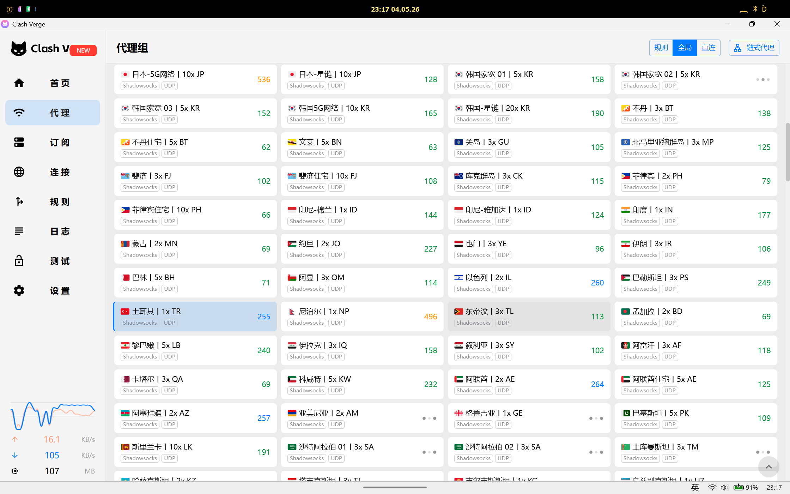
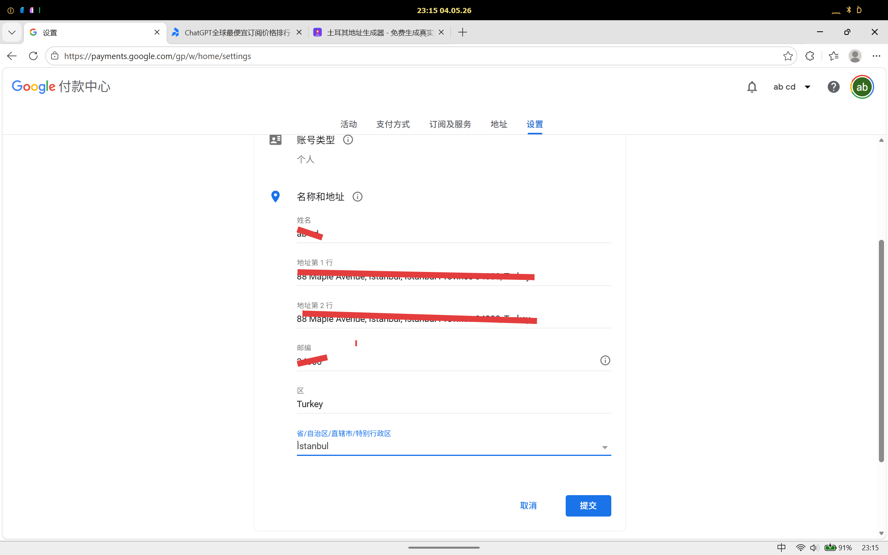
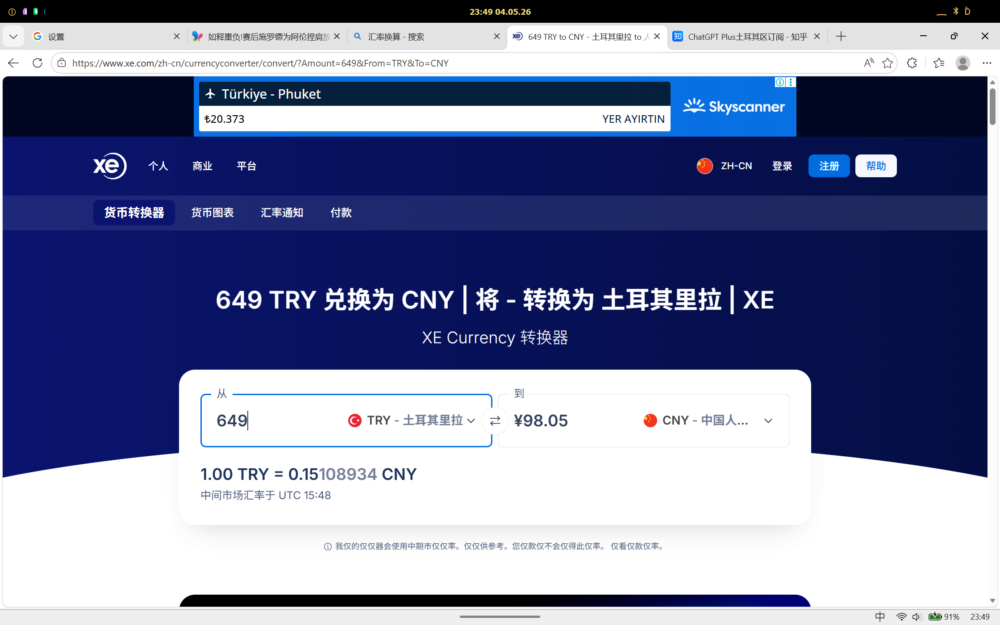
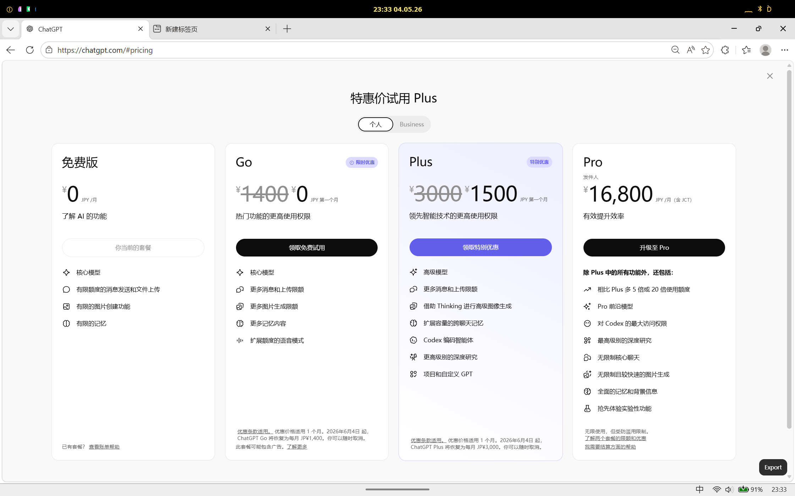
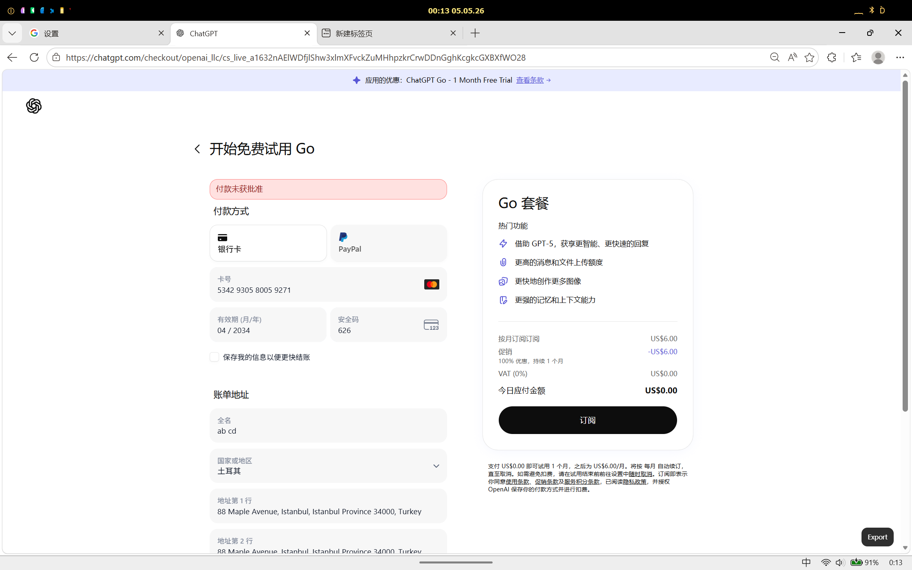

# Cheaper GPT Plus（2026 年 5 月）

低价订阅 ChatGPT Plus 攻略，实测可行。

利用 **土耳其区 Google Play 内购**，以远低于国区/美区的价格订阅 ChatGPT Plus。同样可复用到 Claude 等 Google Play 内购的 AI 订阅。

## 为什么走土耳其？

| 渠道 | 月费 | 折合人民币（参考） |
|------|------|-------------------|
| 官网美区 | $20 USD | ~¥145 |
| 官网国区 | ¥208 | ¥208 |
| Google Play 土区内购 | 含税实付 ~¥98 | ~¥98（含税） |

> 实际汇率以 Google 结算时的里拉兑人民币汇率为准，通常优于银行牌价。

除了价格优势，走 Google Play 内购还能**绕过 OpenAI 官网对中国地区信用卡的风控**——许多国内卡在 OpenAI 官网无法直接绑定，但通过 Google Play 中转不受此限制。

## 前置流程：线下办卡

没有卡一切都白搭。这一步搞定，后面的操作才有意义。

### 信用卡 vs 借记卡

| | 信用卡 | 借记卡 |
|------|------|------|
| **门槛** | 有工作/社保，审批看资质 | 几乎无门槛，带上身份证就能办 |
| **境外支付成功率** | 高（银行默认开放境外在线支付） | 中（部分银行默认关闭，需手动开通） |
| **风控拦截概率** | 低 | 偏高 |
| **推荐度** | ★★★★★ 首选 | ★★★ 备选 |

**能办信用卡就办信用卡。** 招行万事达单标卡审批不算严，有稳定工作基本都能下。

### 办卡注意事项

**去大城市办。** 小城市网点对单标外币卡业务不熟悉，很容易出现「踢皮球」的情况——柜员不清楚流程，告诉你「这卡办不了」或者「去别的网点问问」。作者本人就踩过坑：在老家网点办了一张借记卡，结果柜员后面说「你这张卡被同事拿走了」，白跑一趟。后来直接去省会城市，十几分钟就办好了。

- **借记卡**：带上身份证，去招行网点说「我要办一张万事达单标借记卡」，一般当场拿卡
- **信用卡**：招行掌上生活 App 在线申请，填写资料后等审批，3-7 个工作日寄到

> 办卡时跟柜员说用于「海淘/境外订阅支付」，他们就知道给你开境外在线支付权限了。

## 准备工作

| 物品 | 说明 |
|------|------|
| **招商银行万事达单标卡** | 必须是单标卡，双标卡（银联+万事达）在 Google Play 可能无法通过验证 |
| **土耳其代理/IP** | 用于访问 payments.google.com 和 Google Play 初始设置 |
| **Google 账号** | 推荐准备一个专门用于土区订阅的账号（可避免区域切换的麻烦） |
| **Android 设备或 PC** | PC 端在 payments.google.com 完成付款资料设置，然后到 Android 手机 ChatGPT App 完成订阅 |

## 操作步骤

### Step 1：获取土耳其 IP

开全局代理切换到土耳其节点。确认 IP 已经切换到土耳其：

### Step 2：创建土耳其付款资料

1. 浏览器打开 [payments.google.com](https://payments.google.com)
2. 登录你的 Google 账号
3. 进入「支付方式」→「添加付款方式」
4. 国家/地区选择 **土耳其 (Turkey)**
5. 输入信用卡信息（招行万事达卡号、有效期、CVV）

### Step 3：填写土耳其账单地址

关键是填写一个**真实有效的土耳其地址**（Google 会校验格式）。使用地址生成器或参考以下格式：

> 提示：地址只需格式正确，不需要真实存在（Google Play 不会邮寄账单）。

### Step 4：验证汇率

添加完付款资料后，Google 会显示预估汇率。此时确认里拉兑人民币的汇率是否划算：

### Step 5：在 Android 设备上订阅

1. 在 Android 手机上登录**同一个 Google 账号**
2. 确保 Google Play 商店已经切换到土耳其区（打开 Play 商店看到货币单位为 TRY 即成功）
3. 下载安装 ChatGPT App
4. 在 App 内点击订阅 ChatGPT Plus
5. 通过 Google Play 弹窗确认付款——走已绑定的招行万事达卡

### 为什么不能官网直接订阅？

OpenAI 官网会对支付卡的发卡地区做校验，国内发行的信用卡大概率被拒：

走 Google Play 内购本质上是由 Google 代收代付，绕过了 OpenAI 的风控。

## 复用到 Claude

Claude（Anthropic）的订阅同样支持 Google Play 内购。操作流程完全一致：

1. 保持 Google 账号在土区
2. 在 Android 设备下载 Claude App
3. App 内订阅，走 Google Play 土区结算

一份付款资料，多个 AI 服务通用。

## 下一步：换区还能更省？

土区 ~¥98/月不算最便宜。后续计划测试其他低汇区（如尼日利亚、巴基斯坦等），看招行万事达卡能否通过以及实际扣款金额。如果测通了会更新到本仓库。

## 常见问题

### 招商银行双标卡能用吗？

大概率不行。Google Pay 对双标卡（银联+万事达/Visa）的验证较为严格，建议使用单标万事达卡。如果没有单标卡，可以致电招行申请加办一张万事达单标——通常审批很快。

### 付款被拒怎么办？

1. 检查卡片是否开通了**境外在线支付**功能（招行「掌上生活」App 里可以开关）
2. 确认卡片有效期、CVV 填写正确
3. 尝试换一个土耳其 IP（部分机场的 IP 可能被 Google 标记）
4. 刚添加卡片时 Google 可能会发起一笔 0 TRY 的验证扣款（预授权），确认银行没有拦截

### 地址怎么填？

- 省份/城市选 **İstanbul**（伊斯坦布尔），最稳妥
- 街道地址可以直接用地址生成器生成
- 邮编需要和城市匹配（伊斯坦布尔可用 34000 或 34100）

### 月费会浮动吗？

Google Play 的里拉定价由 OpenAI 设定，一般不会频繁变动。但里拉兑人民币的汇率会波动，所以每月实际扣款金额可能略有差异（通常在 ¥5 以内波动）。

### 会被 OpenAI 封号吗？

走 Google Play 官方内购，合法合规。风险远低于使用第三方代充/合租/镜像站。目前（2026 年 5 月）没有因土区订阅被封号的案例。

## 免责声明

本攻略仅为经验分享，汇率、价格、政策可能随时变化。请以实际操作时的页面为准。若因个人操作导致账号问题或财产损失，作者不承担责任。
